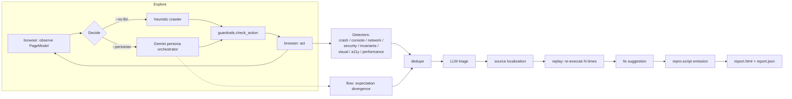

# QAura

[](https://github.com/pelumiibiks-cell/qaura/actions/workflows/ci.yml)

Autonomous QA agent that drives a real browser through a web app, finds broken flows and defects the way a human tester would, confirms each one is actually reproducible, and emits a regression test for it.

QAura explores a target app (deterministic heuristic crawl, or Gemini-driven personas), checks for crashes, console errors, failed requests, visual and accessibility defects, reflected injection, and business-logic invariants defined in a config file, then runs everything it finds through deduplication, replay-based reproducibility checking, source localization, and pytest repro-script generation. A second half applies the same "actually try to break it" approach to trained ML models, live inference endpoints, and chat-shaped GenAI features.

## Key capabilities

- **Two exploration modes.** `core/heuristic.py` is a deterministic, zero-API crawler: breadth-first over unvisited elements, fills whole forms as a unit, fuzzes text fields with a boundary/encoding/injection/format-mismatch corpus, and navigates to the nearest state with unexercised elements once the current page is exhausted. `core/orchestrator.py` drives five Gemini personas (`personas/`: curious, impatient, malicious, power_user, accessibility) that reason about what to try next and state a checkable expectation per action.
- **Eight detectors** (`detectors/`): crash, console, network, security (reflected injection, cross-role access), invariants (declarative business rules from `qaura.yaml`), visual (geometry/contrast rules plus optional vision-model confirmation), accessibility (axe-core), and performance (long tasks, layout shift).
- **Expectation-divergence detection.** In persona mode, `detectors/flow.py` compares the resulting page against the expectation the persona stated before acting, which catches broken flows that throw no error at all.
- **Dedup, triage, replay, localization** (`analysis/`): near-duplicate findings merge; an LLM triage pass can adjust severity or drop confident false positives; every replayable finding is re-executed against a fresh browser to get a real reproducibility rate (confirmed / flaky / not reproduced / not applicable); source localization matches findings to candidate files via a repo-relative search when `repo_path` is set.
- **Repro-script generation** (`reporting/repro.py`). Each finding gets a runnable pytest file that calls the same replay logic the CLI used, so it isn't a hand-authored assertion, it's provably tied to the mechanism that found the bug.
- **Guardrails enforced in code, not in a prompt** (`core/guardrails.py`): domain/path allowlist, a destructive-action classifier, payment/email value substitution, and rate/action/wall-clock/LLM-call caps, checked before every single action regardless of what a persona's prompt says.
- **Config-driven auto-setup.** `qaura init` runs a bounded read-only crawl and proposes guardrails, personas, rate caps, admin paths, and (with a key) validated business-rule invariants, writing an annotated `qaura.generated.yaml`.
- **ML/GenAI testing** (`mltest/`): `qaura ml test` (fairness/calibration/robustness/regression against a trained model artifact), `qaura ml data` (schema, drift, leakage between two datasets), `qaura ml probe` (adversarial and malformed payloads against a live inference endpoint), `qaura ml genai` (prompt injection, jailbreak, PII echo, output-contract checks against a chat feature).

## Results / evidence

`docs/PROGRESS.md` documents every phase being run against two deliberately broken fixtures rather than just unit-tested in isolation: `tests/fixtures/buggy_app` (a FastAPI + JS app with nine seeded bugs) and `tests/fixtures/ml` (a deliberately degraded scikit-learn classifier against a baseline). Examples of what those runs actually showed, taken from that log:

- A full `qaura run --no-llm` against the enriched buggy app produced 31 findings across all seven active detectors at the time, with every seeded bug the phase's detectors targeted caught and no false positives surviving the fix rounds.
- A persona run (`--personas curious`) against the same fixture found the same crash/console/network bugs the heuristic crawler found, plus six expectation-divergence findings the heuristic crawler structurally cannot produce.
- The invariants engine caught the canonical "stale total after a quantity change following a coupon" bug with the exact right numeric values, live-verified against the running fixture, not asserted from reading the code.
- A generated repro script failed against the buggy fixture and passed against a patched copy of it, which is the actual bar the repro-script mechanism is meant to clear.

There is no third-party or published benchmark for QAura; all evidence above is from its own fixtures, run and recorded by the person building it. `tests/` contains 48 test files. This session could not get a full, verified pytest count: `pytest --collect-only` here found 135 collected tests with 33 collection errors, all `ImportError`s from optional dependencies (Playwright browsers, ML extras) not being installed in this environment, not from a broken test suite. Run `pip install -e ".[dev,ml]"` and `playwright install chromium` to collect and run the real total.

## Architecture



Flow (expectation divergence) only runs in persona mode, since it needs an LLM-stated expectation to compare against. Everything else runs in both modes; invariants, visual, and a11y need no LLM at all.

## How it works

The short version is above. For the full pipeline explainer, including exactly what each CLI command does and how invariants and cross-role checks are configured, see `HOW_IT_WORKS.md`. For the build history, every real bug found while building QAura itself, and open questions, see `docs/PROGRESS.md`.

## Engineering decisions

- **Replay is a separate pass from detection, not folded into it.** A detector fires once, during the crawl, under whatever state the crawl happened to be in. `analysis/replay.py` re-executes the finding's full action history against a fresh browser, N times, and compares the resulting fingerprint (`analysis/dedupe.py:fingerprint()`) against the original. This turns "a detector fired once" into a real reproducibility rate (confirmed, flaky, not reproduced), and the repro script it emits inherits correctness from this mechanism instead of needing a second, independent implementation of "did the bug happen."
- **Repro steps capture the full action history up to a finding, not just the triggering action.** Some bugs (the stale-total-after-coupon invariant is the concrete example) only reproduce as a sequence: apply a coupon, then change quantity. An earlier version captured only the last action and could not replay multi-step bugs at all; both crawl loops now snapshot `self._action_history` into every finding.
- **The heuristic crawler and the persona orchestrator are deliberately not factored to share code**, even though both drive a browser through the same detectors. A stale element reference in heuristic mode is a real bug; in persona mode the same symptom can also be a model hallucinating a ref that doesn't exist, which needs its own error handling and a different retry policy.
- **Invariant expressions are a restricted grammar evaluated by an AST whitelist, not `eval()` on user config.** `core/invariants.py`'s `_SafeEval` allows only comparison/arithmetic/boolean nodes and six named builtins (sum/min/max/abs/len/round); attribute access, imports, comprehensions, and lambdas are structurally impossible to reach, not just discouraged by convention. This was chosen over the more expressive nested-object model from the original design once it became clear that model needed either a real object-extraction layer or real `eval()` on a user-edited YAML file, both worse tradeoffs for a config surface.

## Project structure

```
qaura/
  cli.py         all commands: run, init, doctor, observe, auth, replay, report, ml test/probe/genai
  config.py      qaura.yaml + .env loading
  init/          read-only recon, inference rules, invariant synthesis, annotated YAML emission
  llm/           Gemini provider (Interactions API), budget tracking, structured-output schemas
  browser/       Playwright driver, page observation, actions, auth, numeric/selector scanning
  core/          state graph, guardrails, heuristic crawler, persona orchestrator, planner, invariants engine, fuzz corpus
  personas/      five persona system prompts
  detectors/     crash, console, network, visual, a11y, security, performance, flow (divergence)
  analysis/      dedupe, LLM triage, source localization, fix suggestions, replay, visual baselines
  reporting/     Finding/RunReport models, HTML report, repro-script generation
  mltest/        model registry + four suites: artifact, data/drift, endpoint, genai
tests/
  unit/          unit tests, one file per module
  fixtures/buggy_app/   deliberately buggy FastAPI + JS app used to prove every detector fires on a real target
  fixtures/ml/          deliberately degraded classifier + baseline used to prove every ML check fires
```

## Installation

```
python -m venv .venv
.venv\Scripts\activate
pip install -e ".[dev,ml]"
playwright install chromium
```

Copy `.env.example` to `.env` and set `GEMINI_API_KEY`. Without a key, QAura runs in heuristic mode: the crawler, every detector, invariants, dedupe, replay, localization, and repro-script generation all work at zero API cost. A key adds persona-driven exploration, expectation-divergence detection, LLM triage, and suggested fixes.

## Usage

```
qaura doctor                             # verify the Gemini key and reachable models
qaura init --url <url>                   # analyze a site and propose a config for it
qaura observe <url>                      # print the distilled page model for a URL
qaura auth capture --url <url> --role user   # save a login session for reuse

qaura run --url <url> --no-llm           # heuristic crawl, zero API spend
qaura run --url <url> --personas curious,impatient
qaura run --url <url> --no-llm --ci --fail-on high   # CI gate: exit 1 on high+ findings

qaura report runs/<timestamp>            # regenerate HTML from a saved run
qaura replay runs/<timestamp>            # re-confirm reproducibility for a saved run

qaura ml test --model model.joblib --data eval.csv --slice-col group --baseline prior.joblib
qaura ml probe --endpoint http://localhost:8000/predict --payload '{"x": 1}'
qaura ml genai --url <url> --input-ref e1 --send-ref e2 --response-selector "#chat-response"
```

Full flag reference for every command: `COMMANDS.md`.

## Testing

```
pytest
```

CI (`.github/workflows/ci.yml`) runs `ruff check`, `pytest` across Python 3.11 to 3.13 on Ubuntu and 3.12 on Windows, and a package build/metadata check on every push to `main` and every pull request. `tests/` has 48 test files. Some tests need optional extras (`playwright install chromium`, the `ml` extra) to collect; without them a handful skip or fail to import rather than silently pass, by design.

## Limitations

- The LLM-persona crawl path (`--personas`) has not yet received the form-awareness and frontier-navigation work the deterministic heuristic crawler has. A persona run today explores noticeably more shallowly than heuristic mode on the same page. `--no-llm` mode is unaffected. See `HOW_IT_WORKS.md`.
- Open redirect detection is not implemented. Cross-role access checking exists but is opt-in and needs `admin_paths` configured by hand, since QAura can't infer which routes are privileged from the page alone.
- Reaching a specific multi-step bug (apply a coupon, then change quantity) with the undirected heuristic crawler is not guaranteed on any given run; the crawler explores independently rather than sequencing actions with intent. Persona mode is a better fit for that class of bug.
- All correctness evidence in this repo comes from two purpose-built fixtures, not from a third-party benchmark or a production deployment. See "Results / evidence" above.
- Model artifact loading (`.pkl`/`.joblib`/`.pt`) deserializes a pickle, which can execute arbitrary code. Only point `qaura ml test`/`qaura ml probe` at model files you trust.
- Replay cost scales with a finding's full action history; a long single-page crawl can make a late-discovered finding expensive to replay N times. Noted as a known, unfixed scaling limitation in `docs/PROGRESS.md`, not something silently hidden.

## Security and contributing

See `SECURITY.md` for scope-of-use requirements (only test applications you're authorized to test) and the model-artifact pickle risk, and `CONTRIBUTING.md` for the development setup and workflow.
